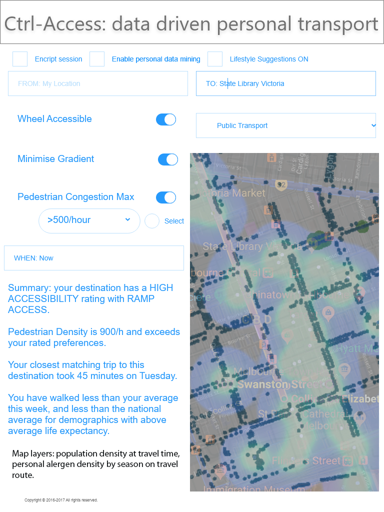
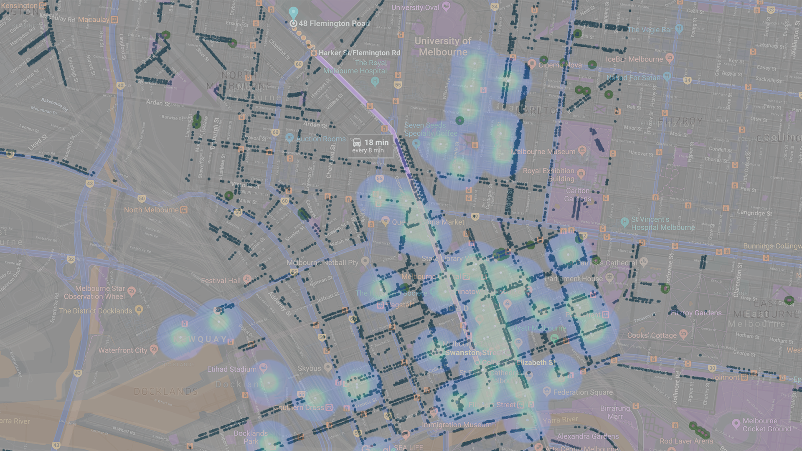
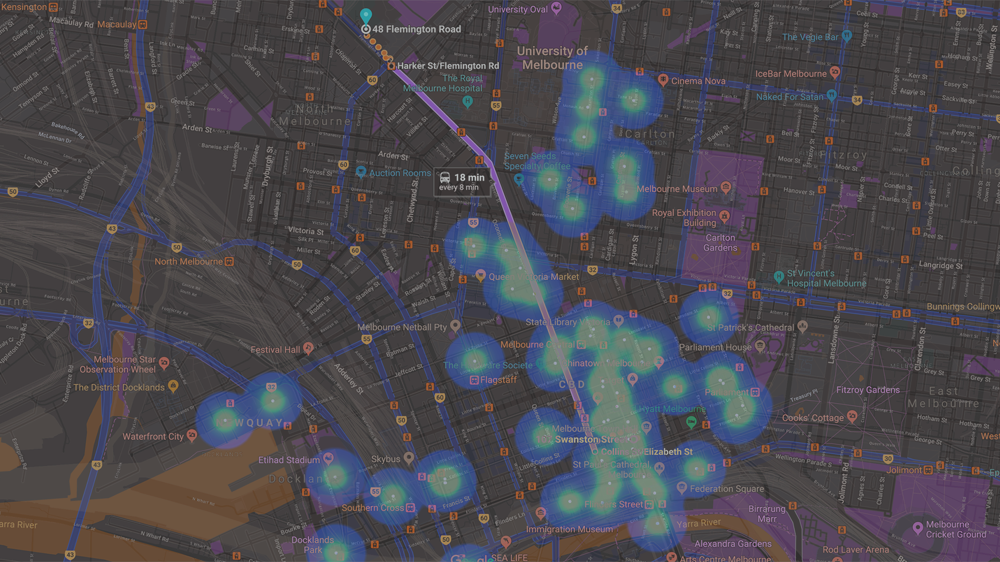
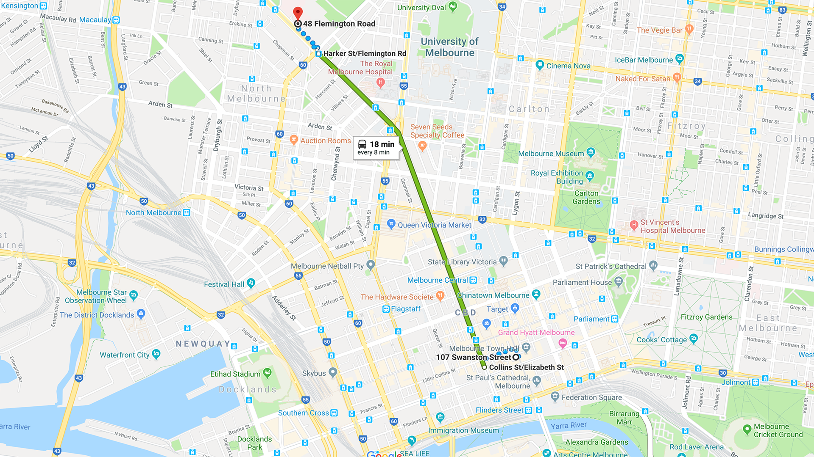

# README for Ctrl-Access

## Created for GovHack 2018

Ctrl-Access aims to allow individuals to access open data sets to help make decisions in their personal lives. We envision an open marketplace where developers can create lifestyle modules that link specific data sets with different lifestyle ideas, for example, how does an individual's activity data stack up against the activity data for long-lived individuals?

This repo represents a small part of one such module. Linking building accessibility data, pedestrian volume data and tree data from the Melbourne CBD, this module will provide information on how to move through the city according to your accessibility needs. This code does calculations for pedestrian sensor data.

**Project Description**

Ctrl-Access - Control your data, Access data relevant to you. 

Our project focus is empowering individuals to take control of their interactions with government data, and to mine their personal data.

We do this through a configurable, secure client. The client can interact with user data, government data and user configured options to make pertinent data available through Alexa voice query and custom query forms.

Ctrl-Access is a modular reporting platform on government and personal data. We envision an open 2-way marketplace where developers can create lifestyle modules that link specific data sets with different lifestyle ideas. For example, how does an individual's activity data stack up against the activity data for long-lived individuals, or how could a person with specific floral allergies move safely and comfortably through a city? Individuals can subscribe to these modules as appropriate to their lives.

With thanks to Telstra Data Labs, especially Ryan and John, for their help throughout the weekend.

**Data Story: Ctrl-Access**

The wealth of data on all aspects of society and the individual presents a unique opportunity to improve the quality of life of Australians. We are interested in empowering individuals to engage with their personal data and compare with government data in ways that will provide insights for their lives. Ctrl Access will enable users to interact with government datasets in a way particular to their individual data profile. 

Our demonstrated use-case is for an Accessibility Module. Given the requirement of needing wheeled access to buildings and public transport, the Accessibility Module checks building data and transport routes, as well as pedestrian volume along the route. Another potential use-case for accessibility is around the avoidance of environmental allergens, such as London Plane trees.

We also envisage Ctrl-Access as a way of optimising health and well-being, as with [this video](https://www.youtube.com/watch?v=7c8O_XqZf78) where Alexa is interacting with the user about a computer game. Like the video, where he wants to know how to improve, and Alexa compares his data to everyone’s game play data and makes suggestions, Ctrl-Access will compare a user’s data to existing datasets to make lifestyle recommendations. For example, based on what Ctrl-Access knows about you and on the datasets it has access to, it could suggest tailored activities based on your demographic profile and preferences.

**Interface Mockup: Accessibility Module**

Here is what the interface for the Accessibility Module of Ctrl-Access could look like. We also envision an Alexa skill based on this module,so users with different access requirements can use the module.

Another user would avoid trees known to trigger allergies.

Map of Type of trees know to trigger allergies.

Pedestrian Heat Sensor Map

Accessible Route Map

**Project Video**

[YouTube Video](https://www.youtube.com/watch?v=-8LEbqg0pfE&feature=youtu.be)

**Project Creators**

[Celia King](https://github.com/colquhounking)
Daniel Nimmo
Vanessa Nimmo
Bianca Carnevale